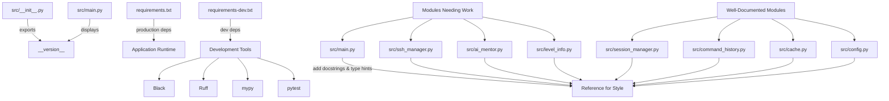

# Code Quality Improvement Plan for v0.2.0

## Observations

The codebase shows mixed code quality standards:

- **Well-documented modules** (`src/session_manager.py`, `src/command_history.py`, `src/cache.py`, `src/config.py`) already follow best practices with comprehensive docstrings and type hints.
- **Core modules** (`src/main.py`, `src/ssh_manager.py`, `src/ai_mentor.py`, `src/level_info.py`) lack consistent documentation.
- **No version management** is implemented.
- **Development dependencies** (`pytest`, `pytest-cov`) are incorrectly placed in production requirements.
- **Critical issues** include:
  - Duplicate `on_mount` methods in `src/main.py`
  - References to undefined `self.offline_mode` attribute

---

## Approach

Establish consistent code quality standards across all modules by:

1. Adding version management
2. Completing docstrings in **Google/NumPy format** for undocumented modules
3. Adding missing **type hints** to core modules
4. Creating proper **development dependencies separation**

Prioritize fixing critical code issues first, then systematically improve documentation and type safety while preserving existing good practices. Goal: achieve **production-ready quality** for the **v0.2.0 release**.

---

## Implementation Steps

### 1. Version Management Implementation

#### `src/__init__.py`
- Define `__version__ = "0.2.0"` at the top
- Add module-level docstring describing the package
- Export version in `__all__` list

#### `src/main.py`
- Import version: `from . import __version__`
- Modify `on_mount` (lines 158–168) to include version in subtitle:
  ```python
  self.sub_title = f"A terminal interface for OverTheWire Bandit v{__version__}"
  ```
  _Alternatively_, add version to footer widget composition.

#### Fix Critical Issues in `src/main.py`
- **Remove duplicate `on_mount`**: Delete lines 83–87 (superseded by lines 158–168); merge any unique logic.
- **Initialize `offline_mode`**: Add `self.offline_mode = False` in `BanditCLIApp.__init__` (after line 72), as it’s referenced in `send_command` (line 275) and `send_mentor_message` (line 333).

---

### 2. Create Development Dependencies File

#### `requirements-dev.txt`
```txt
# Development-only dependencies
black>=23.0.0
ruff>=0.1.0
mypy>=1.7.0
pytest>=8.2.0
pytest-cov>=5.0.0
pytest-asyncio>=0.23.0  # if async tests are used
```

#### Update `requirements.txt`
- **Remove** `pytest==8.2.0` and `pytest-cov==5.0.0`
- **Keep production dependencies**:
  - `textual`, `paramiko`, `openai`, `litellm`, `beautifulsoup4`, `requests`, `python-dotenv`

---

### 3. Add Comprehensive Docstrings

Use **Google-style format**:
- One-line summary + detailed description
- Include `Args`, `Returns`, `Raises` where applicable

#### `src/main.py`
| Element | Action |
|--------|--------|
| Module-level | Describe main Textual app and `BanditCLIApp` purpose |
| `BanditCLIApp` class | Add `Attributes` section (reactive props, managers); document `CSS_PATH`, `BINDINGS` |
| Methods | Add/enhance docstrings for all methods (see full list in original spec) |

#### `src/ssh_manager.py`
- Module docstring: explain `SSHConnection` and `SSHManager`
- `SSHConnection` class: document thread-safe design and all attributes
- **Remove unused `_create_ssh_client`** (lines 56–66)
- Add docstrings for all methods (`connect`, `disconnect`, `send_command`, etc.)
- `SSHManager` class: explain multi-session management

#### `src/ai_mentor.py`
- Module docstring: describe AI mentor, OpenAI + LiteLLM integration
- `BanditAIMentor` class: document educational approach and attributes
- Enhance method docstrings (`get_response`, `get_level_hint`, `explain_command`, etc.)

#### `src/level_info.py`
- Module docstring: describe JSON-based level data handling
- `BanditLevelInfo` class: document data loading and access patterns
- Add docstrings for all accessor methods (`get_level_info`, `search_levels`, etc.)

---

### 4. Add Type Hints

#### `src/main.py`
Add imports:
```python
from typing import Optional, List, Callable, Any
```

Enhance method signatures (examples):
- `_notify_wrapper(self, message: str, severity: str) -> None`
- `on_button_pressed(self, event: Button.Pressed) -> None`
- `on_resize(self, event: ResizeEvent) -> None` *(use proper event type)*

> Note: Many methods already have correct return types (`ComposeResult`).

#### `src/ssh_manager.py`
- Most type hints exist; verify completeness
- Add missing return types:
  - `_read_output(self) -> None`
  - `send_command(self, command: str) -> None`
  - `disconnect(self) -> None`

#### `src/ai_mentor.py`
- Verify imports: `List`, `Dict`, `Callable`, `Generator`, `Optional`
- Ensure:
  ```python
  __init__(self, notify_callback: Callable[[str, str], None], model: Optional[str] = None, data_file_path: str = "ai_mentor_data.json") -> None
  get_level_hint(self, level_num: int) -> str
  explain_command(self, command: str) -> str
  ```

---

### 5. Configuration Files for Code Quality Tools

#### `ruff.toml`
```toml
line-length = 100
select = ["E", "F", "W", "I", "N"]
ignore = ["E501"]  # handled by Black
exclude = [".venv", "venv", "__pycache__", ".git"]
```

#### `pyproject.toml`
```toml
[tool.black]
line-length = 100
target-version = ['py38']
include = '\.pyi?$'

[tool.mypy]
python_version = "3.8"
warn_return_any = true
warn_unused_configs = true
disallow_untyped_defs = false
disallow_incomplete_defs = false
check_untyped_defs = true
```

---

### 6. Documentation Updates

#### `README.md`
- Add version badge:  
  ``
- Add **Development** section:
  ```markdown
  ### Development
  Install dev dependencies:
  ```bash
  pip install -r requirements-dev.txt
  ```
  Code quality tools: Black (formatting), Ruff (linting), mypy (type checking).
  ```

#### (Optional) `docs/development.md`
- Document dev setup
- Explain tool usage (`black src/`, `ruff check`, `mypy src/`)
- Specify docstring format and type hint conventions

---

## Verification Steps

| Check | Command / Method |
|------|------------------|
| **Version** | `python -c "from src import __version__; print(__version__)"` |
| **UI Display** | Launch app; confirm version in subtitle/footer |
| **Dev Deps** | `pip install -r requirements-dev.txt` → `black --version`, etc. |
| **Formatting** | `black src/ tests/` |
| **Linting** | `ruff check src/ tests/` (no critical errors) |
| **Type Checking** | `mypy src/` (improved coverage) |
| **Docstrings** | Manual review or `pydoc`/Sphinx generation |
| **Tests** | `pytest tests/` (all pass, no regressions) |

---

## Architecture Overview



---

## Module Documentation Status

| Module | Current Docstrings | Current Type Hints | Action Required |
|--------|--------------------|--------------------|-----------------|
| `src/main.py` | Partial | Partial | Add comprehensive docstrings and complete type hints |
| `src/ssh_manager.py` | Minimal | Good | Add comprehensive docstrings; remove unused method |
| `src/ai_mentor.py` | Partial | Good | Enhance existing docstrings |
| `src/level_info.py` | Minimal | Good | Add comprehensive docstrings |
| `src/session_manager.py` | ✅ Excellent | ✅ Excellent | Use as reference |
| `src/command_history.py` | ✅ Excellent | ✅ Excellent | Use as reference |
| `src/cache.py` | ✅ Excellent | ✅ Excellent | Use as reference |
| `src/config.py` | ✅ Excellent | ✅ Excellent | Use as reference |

---

## Critical Issues to Fix

1. **Duplicate `on_mount`** in `src/main.py` (lines 83–87 and 158–168) → **Remove first**
2. **Undefined `self.offline_mode`** → **Initialize in `__init__`**
3. **Unused `_create_ssh_client`** in `src/ssh_manager.py` (lines 56–66) → **Remove**