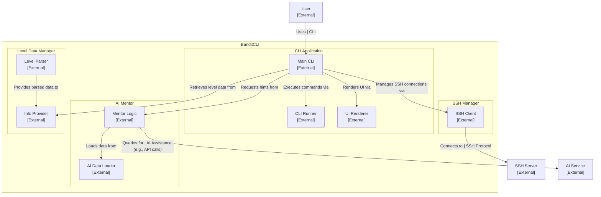

# Unnamed CodeViz Diagram

```mermaid
graph TD

    user["User<br>[External]"]
    sshServer["SSH Server<br>[External]"]
    aiService["AI Service<br>[External]"]
    subgraph banditCLI["BanditCLI<br>[External]"]
        subgraph cliApp["CLI Application<br>[External]"]
            mainCLI["Main CLI<br>[External]"]
            cliRunner["CLI Runner<br>[External]"]
            uiRenderer["UI Renderer<br>[External]"]
            %% Edges at this level (grouped by source)
            mainCLI["Main CLI<br>[External]"] -->|"Executes commands via"| cliRunner["CLI Runner<br>[External]"]
            mainCLI["Main CLI<br>[External]"] -->|"Renders UI via"| uiRenderer["UI Renderer<br>[External]"]
        end
        subgraph sshManager["SSH Manager<br>[External]"]
            sshClient["SSH Client<br>[External]"]
        end
        subgraph aiMentor["AI Mentor<br>[External]"]
            mentorLogic["Mentor Logic<br>[External]"]
            dataLoader["AI Data Loader<br>[External]"]
            %% Edges at this level (grouped by source)
            mentorLogic["Mentor Logic<br>[External]"] -->|"Loads data from"| dataLoader["AI Data Loader<br>[External]"]
        end
        subgraph levelDataManager["Level Data Manager<br>[External]"]
            levelParser["Level Parser<br>[External]"]
            infoProvider["Info Provider<br>[External]"]
            %% Edges at this level (grouped by source)
            levelParser["Level Parser<br>[External]"] -->|"Provides parsed data to"| infoProvider["Info Provider<br>[External]"]
        end
        %% Edges at this level (grouped by source)
        mainCLI["Main CLI<br>[External]"] -->|"Manages SSH connections via"| sshClient["SSH Client<br>[External]"]
        mainCLI["Main CLI<br>[External]"] -->|"Requests hints from"| mentorLogic["Mentor Logic<br>[External]"]
        mainCLI["Main CLI<br>[External]"] -->|"Retrieves level data from"| infoProvider["Info Provider<br>[External]"]
    end
    %% Edges at this level (grouped by source)
    user["User<br>[External]"] -->|"Uses | CLI"| mainCLI["Main CLI<br>[External]"]
    sshClient["SSH Client<br>[External]"] -->|"Connects to | SSH Protocol"| sshServer["SSH Server<br>[External]"]
    mentorLogic["Mentor Logic<br>[External]"] -->|"Queries for | AI Assistance (e.g., API calls)"| aiService["AI Service<br>[External]"]

```
---
*Generated by [CodeViz.ai](https://codeviz.ai) on 1/17/2026, 2:43:05 PM*
